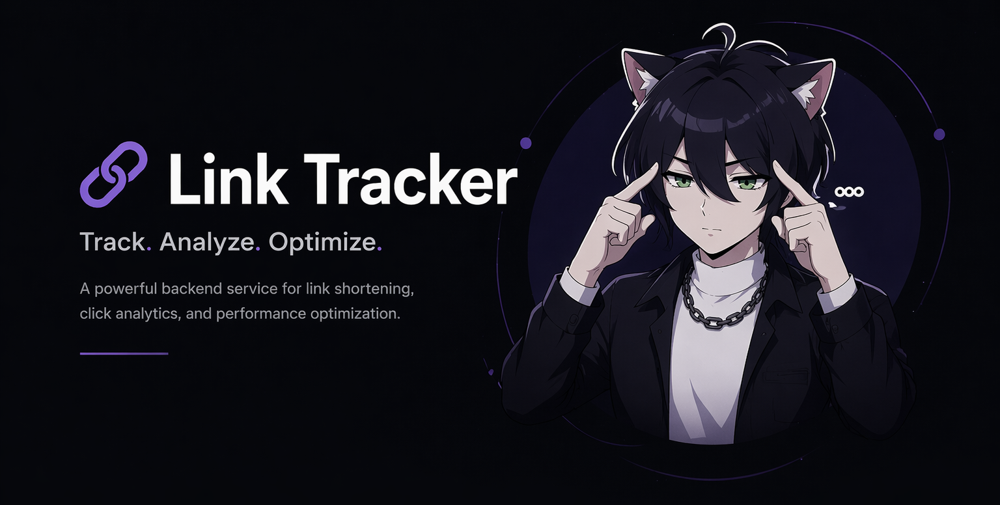
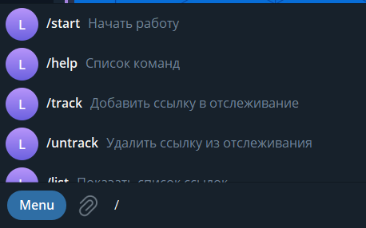
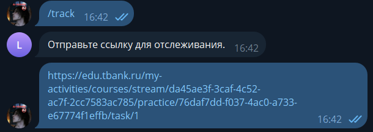
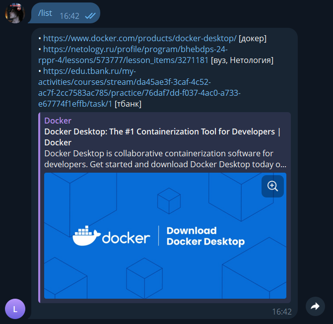
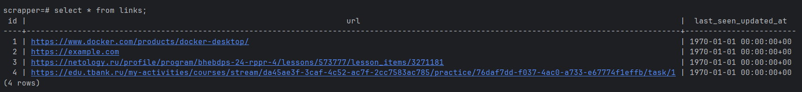
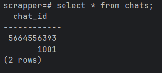

# LinkTracker

> **LinkTracker** — Telegram-бот для отслеживания изменений на веб-страницах с оперативным уведомлением пользователя.

[](#)
[](#)
[](#)
[](#)
[](#)

## О проекте

На текущем этапе в проекте уже реализован базовый каркас сервиса `bot` с обработкой следующих команд:

- `/start`
- `/help`
- `/track`
- `untrack`
- `/list`
- `/cancel`

Также предусмотрен ответ на неизвестные команды.

Помимо этого, в проекте уже реализована полноценная система баз данных. Подробнее о её использовании можно прочитать в разделе **п.4**.

Дополнительную полезную информацию для разработки проекта можно найти в файле [HELP.md](./HELP.md).

---

## Содержание

- [п.1 FYI: как привязать бота?](#п1-fyi-как-привязать-бота)
- [п.2 Запуск приложения](#п2-запуск-приложения)
- [п.3 Запуск Scrapper](#п3-запуск-scrapper)
- [п.4 Запуск БД](#п4-запуск-бд)
- [Демонстрация правильной работы приложения и баз данных](#демонстрация-правильной-работы-приложения-и-баз-данных)
- [Запуск проверок](#запуск-проверок)
- [Структура модулей](#структура-модулей)

---

## п.1 FYI: как привязать бота?

Чтобы запустить бота, необходимо в **PowerShell** в корне проекта прописать переменную окружения:

```powershell
$env:BOT_TOKEN="ВАШ_ТОКЕН"
```

После этого бот можно запустить следующей командой:

```powershell
.\mvnw.cmd -f bot\pom.xml spring-boot:run
```

> [!IMPORTANT]
> Для запуска требуется **JDK 25 и выше**.

---

## п.2 Запуск приложения

Запуск приложения из корня репозитория:

```powershell
.\mvnw.cmd -f bot\pom.xml spring-boot:run
```

---

## п.3 Запуск Scrapper

Для запуска сервиса `scrapper` используйте:

```powershell
..\mvnw.cmd spring-boot:run -DskipTests "-Dspring-boot.run.arguments=--spring.datasource.url=jdbc:postgresql://localhost:5433/scrapper --spring.datasource.username=scrapper --spring.datasource.password=scrapper"
```

---

## п.4 Запуск БД

Первым делом необходимо запустить у себя на ПК **Docker**.

Затем выполните следующие команды:

```powershell
docker compose up -d postgres
..\mvnw.cmd spring-boot:run -DskipTests "-Dspring-boot.run.arguments=--spring.datasource.url=jdbc:postgresql://localhost:5433/scrapper --spring.datasource.username=scrapper --spring.datasource.password=scrapper"
```

> [!NOTE]
> База данных поднимается в Docker, а приложение получает параметры подключения через аргументы запуска Spring Boot.

---

# Демонстрация правильной работы приложения и баз данных

## Пользовательская часть

### 1. Меню доступных команд

При вводе символа `/` в Telegram появляется меню-подсказка со всеми доступными командами.



### 2. Добавление ссылки в отслеживание

Чтобы добавить ссылку, необходимо выполнить команду `/track`, а затем, желательно, добавить теги. Пример показан на изображении ниже.



### 3. Просмотр отслеживаемых ссылок

Команда `/list` позволяет вывести все ссылки, которые были добавлены в отслеживание.



---

## Для разработчиков

### 4. Проверка работы базы данных через `psql`

Для проверки работы базы данных необходимо зайти внутрь `psql`:

```powershell
docker exec -it link-tracker-postgres-1 psql -U scrapper -d scrapper
```

После входа в `psql` можно выполнить следующие команды для просмотра структуры таблиц:

```powershell
\dt
\d chats
\d links
\d subscriptions
\d subscription_filters
```

Также можно проверить, что база данных действительно хранит данные. Для этого выполните:

```powershell
insert into chats(chat_id) values (1001);
insert into links(url) values ('https://example.com');
insert into subscriptions(chat_id, link_id)
values (
  1001,
  (select id from links where url = 'https://example.com')
);

select * from chats;
select * from links;
select * from subscriptions;
```

Пример корректной работы:




---

## Запуск проверок

### Локальный запуск тестов только для модуля `bot`

```powershell
.\mvnw.cmd -pl bot -am test
```

### Проверка форматирования и статики (как в CI)

```powershell
.\mvnw.cmd compile -am spotless:check modernizer:modernizer spotbugs:check pmd:check pmd:cpd-check
```

---

## Структура модулей

- `bot` — Telegram Bot API и обработка команд
- `scrapper` — заготовка сервиса мониторинга источников
- `ai-agent` — заготовка AI-сервиса

---

## Кратко о назначении модулей

Чтобы было проще ориентироваться в проекте:

- `bot` отвечает за взаимодействие с пользователем через Telegram.
- `scrapper` нужен для отслеживания изменений в источниках.
- `ai-agent` выступает как заготовка AI-сервиса для дальнейшего расширения проекта.

---

## Итог

Сейчас проект уже содержит:

- базовый Telegram-бот с набором команд,
- отдельный сервис `scrapper`,
- подключаемую базу данных PostgreSQL,
- набор команд для ручной проверки таблиц и данных,
- тесты и проверки качества кода,
- модульную структуру для дальнейшего развития.

